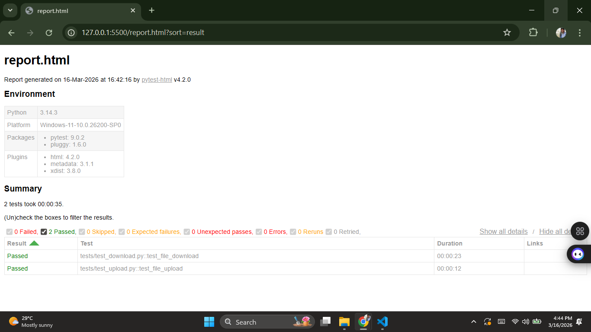

# Selenium Python File Upload & Download Automation Framework


---

## 📌 Project Overview

This project demonstrates an **automation testing framework built using Python, Selenium WebDriver, and PyTest**.

The framework automates **file upload and file download functionality** and generates a **detailed HTML test report**.

It also integrates **GitHub Actions CI/CD pipeline** to automatically run tests whenever code is pushed to the repository.

---

## 🚀 Features

* File Upload Automation
* File Download Automation
* Page Object Model (POM) design pattern
* Screenshot capture on test failure
* HTML Test Reports using pytest-html
* Custom Chrome download directory
* WebDriver Manager integration
* GitHub Actions CI/CD pipeline
* Headless browser execution for CI

---

## 🛠 Tech Stack

* Python
* Selenium WebDriver
* PyTest
* WebDriver Manager
* GitHub Actions

---

## 📁 Project Structure

```
selenium-python-file-automation
│
├── .github
│   └── workflows
│       └── selenium-tests.yml
│
├── pages
│   ├── upload_page.py
│   └── download_page.py
│
├── tests
│   ├── test_upload.py
│   └── test_download.py
│
├── utils
│   ├── driver_setup.py
│   └── screenshot.py
│
├── testdata
│   └── sample.txt
│
├── downloads
├── screenshots
├── assets
│   └── report.png
│
├── requirements.txt
└── README.md
```

---

## ▶ How to Run Tests Locally

### Install dependencies

```
pip install -r requirements.txt
```

### Run automation tests

```
pytest
```

### Generate HTML report

```
pytest --html=report.html
```

---

## 📊 Test Report

The framework generates an **HTML report** after execution.

Example:



---

## ⚙ CI/CD Pipeline

The project uses **GitHub Actions** to automatically run Selenium tests whenever code is pushed.

Workflow:

```
Push Code
   ↓
GitHub Actions Triggered
   ↓
Install Dependencies
   ↓
Install Chrome Browser
   ↓
Run Selenium Tests
   ↓
Generate HTML Test Report
```

---

## 👨‍💻 Author

**Prajwal Joshi**

Full Stack Developer | Automation Enthusiast
